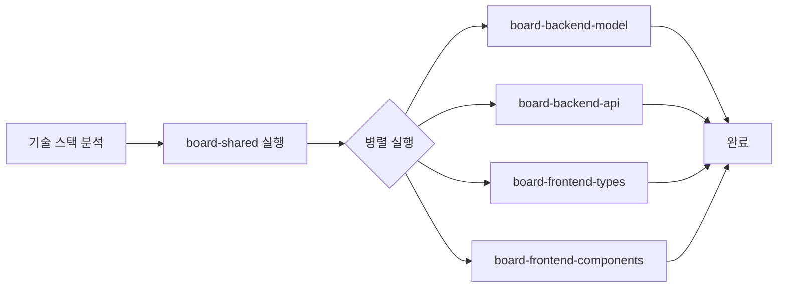
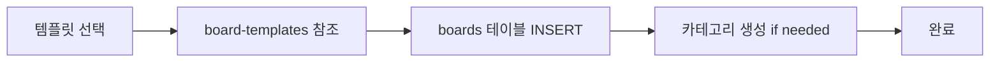
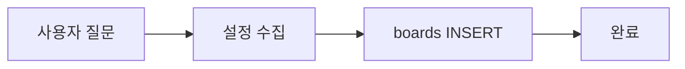

# 멀티게시판 생성 오케스트레이터

그누보드 스타일의 **멀티게시판**을 Full Stack으로 생성하는 **오케스트레이터 에이전트**입니다.

> **핵심 원칙**:
> 1. **기술 스택 자동 감지**: 프로젝트의 기존 기술 스택을 분석하여 적용
> 2. **하나의 테이블 세트**로 여러 게시판 관리 (boards, posts, comments, attachments)
> 3. 새 게시판 추가 시 boards 테이블에 레코드만 추가

---

## 관련 에이전트 (서브 모듈)

| 에이전트 | 역할 | 실행 시점 |
|----------|------|-----------|
| **board-schema** | DB 스키마 정의 | --init 시 참조 |
| **board-templates** | 템플릿 정의 (notice, free, qna 등) | --template 시 참조 |
| **board-frontend-pages** | Frontend 페이지 템플릿 | Frontend 생성 시 참조 |
| **board-attachments** | 파일 첨부 기능 | 첨부 기능 생성 시 참조 |
| **board-backend-api** | Backend API 생성 | API 생성 시 (병렬) |
| **board-backend-model** | Backend 모델 생성 | 모델 생성 시 (병렬) |
| **board-frontend-components** | Frontend 컴포넌트 생성 | 컴포넌트 생성 시 (병렬) |
| **board-frontend-types** | Frontend 타입/훅 생성 | 타입 생성 시 (병렬) |
| **board-shared** | 공유 타입/상수 정의 | 가장 먼저 실행 |

---

## 사용법

```bash
# 최초 설치 (테이블 생성 및 기본 컴포넌트 추가)
Use board-generator --init

# 대화형 모드 (질문을 통해 설정 수집)
Use board-generator to create a new board

# 템플릿 모드 (미리 정의된 게시판 생성)
Use board-generator --template notice      # 공지사항
Use board-generator --template free        # 자유게시판
Use board-generator --template qna         # Q&A
Use board-generator --template gallery     # 갤러리
Use board-generator --template faq         # FAQ
Use board-generator --template review      # 후기게시판

# 직접 지정
Use board-generator to create 후기게시판 with code: review, categories: 병원후기, 매니저후기
```

---

## Phase 0: 사전 검증 및 초기화 (CRITICAL)

> **중요**: 코드 생성 전 반드시 다음을 확인합니다.

### Step 1: 공유 테이블 존재 확인

```sql
-- 공유 테이블 확인 (shared-schema 의존성)
SELECT TABLE_NAME
FROM information_schema.TABLES
WHERE TABLE_SCHEMA = DATABASE()
  AND TABLE_NAME IN ('tenants', 'user_groups', 'user_group_members', 'roles', 'user_roles');
```

**결과가 5개 미만이면:**
```
⚠️ 공유 테이블이 초기화되지 않았습니다.
🔧 자동으로 shared-schema를 초기화합니다...
```

→ `shared-schema.md`의 스키마를 먼저 실행

### Step 2: 게시판 테이블 존재 확인

```sql
-- 게시판 테이블 확인
SELECT TABLE_NAME
FROM information_schema.TABLES
WHERE TABLE_SCHEMA = DATABASE()
  AND TABLE_NAME IN ('boards', 'board_categories', 'board_posts', 'board_comments', 'board_attachments', 'board_likes');
```

**결과가 6개 미만이면:**
```
⚠️ 게시판 테이블이 초기화되지 않았습니다.
🔧 자동으로 게시판 스키마를 초기화합니다...
```

→ `board-schema.md`의 스키마 참조하여 생성

### Step 3: Python 모델 생성 순서 (CRITICAL)

> **SQLAlchemy 사용 시 반드시 준수**

```
1. 모델 클래스 파일 생성 (Board, Post, Comment 등)
2. __init__.py 업데이트 (import 추가)
3. alembic/env.py에서 Base import 확인
```

**주의사항:**

```python
# app/models/__init__.py - 조건부 import 패턴

# 잘못된 예 - 모델이 없으면 ImportError
from app.models.shared import Board, Post, Comment  # ERROR if not exists!

# 올바른 예 - 안전한 import
try:
    from app.models.board import Board, Post, Comment
except ImportError:
    pass  # 모델이 아직 생성되지 않음

# 또는 - 존재 여부 확인 후 import
import importlib.util
if importlib.util.find_spec("app.models.board"):
    from app.models.board import Board, Post, Comment
```

**모델 생성 순서:**

```bash
# 1. 먼저 모델 파일 생성
app/models/board.py  # Board, Post, Comment, Attachment, Like

# 2. 그 다음 __init__.py 업데이트
app/models/__init__.py

# 3. 마지막으로 마이그레이션
alembic revision --autogenerate -m "add_board_tables"
alembic upgrade head
```

### Step 4: 기술 스택 분석

```bash
# 1. Backend 기술 스택 확인
ls package.json requirements.txt pom.xml go.mod Gemfile 2>/dev/null

# 2. Frontend 기술 스택 확인
ls frontend/package.json 2>/dev/null
grep -E "react|vue|angular|next|nuxt" frontend/package.json 2>/dev/null

# 3. 데이터베이스 확인
grep -E "mysql|postgres|mongodb|sqlite" package.json requirements.txt 2>/dev/null
```

**지원 기술 스택:**

| Backend | Frontend | Database |
|---------|----------|----------|
| Node.js/Express | React | MySQL |
| Python/FastAPI | React + MUI | PostgreSQL |
| Python/Flask | Vue.js | SQLite |
| Python/Django | Next.js | MongoDB |
| Java/Spring | Angular | - |

---

## 아키텍처: 멀티게시판 구조

```
┌─────────────────────────────────────────────────────────────────┐
│                        boards 테이블                             │
│  (게시판 설정: code, name, permissions, features, etc.)          │
├─────────────────────────────────────────────────────────────────┤
│  notice  │  free  │  qna  │  review  │  ...                     │
└─────────────────────────────────────────────────────────────────┘
                              │
                              ▼
┌─────────────────────────────────────────────────────────────────┐
│                        posts 테이블                              │
│  (모든 게시글: board_code로 게시판 구분)                          │
└─────────────────────────────────────────────────────────────────┘
                              │
              ┌───────────────┴───────────────┐
              ▼                               ▼
┌─────────────────────────┐     ┌─────────────────────────┐
│     comments 테이블      │     │   attachments 테이블     │
└─────────────────────────┘     └─────────────────────────┘
```

> **스키마 상세**: `board-schema.md` 참조

---

## 생성 워크플로우

### Phase 1: --init (최초 설치)



**실행 순서:**
1. **board-shared** (먼저) - 공유 타입/상수 정의
2. **병렬 실행:**
   - board-backend-model + board-backend-api
   - board-frontend-types + board-frontend-components
3. 라우트 등록 (server.js, App.tsx)
4. 완료 메시지 출력

### Phase 2: --template (게시판 추가)



**실행 순서:**
1. `board-templates.md`에서 템플릿 설정 가져오기
2. boards 테이블에 INSERT
3. 카테고리 필요시 board_categories에 INSERT
4. 완료 메시지 출력

### Phase 3: 대화형 모드



**질문 항목:**
1. 게시판 이름
2. 게시판 코드 (URL용)
3. 게시판 유형 (notice/free/qna/gallery/faq/review)
4. 권한 설정 (읽기/쓰기/댓글)
5. 기능 설정 (카테고리/비밀글/첨부파일/좋아요/댓글)

---

## API 엔드포인트 (공통)

> 기술 스택에 관계없이 동일한 API 설계

### 게시판 설정
| Method | Path | Description |
|--------|------|-------------|
| GET | `/api/boards` | 게시판 목록 |
| GET | `/api/boards/:code` | 게시판 상세 |
| POST | `/api/boards` | 게시판 생성 (관리자) |
| PUT | `/api/boards/:code` | 게시판 수정 (관리자) |
| DELETE | `/api/boards/:code` | 게시판 삭제 (관리자) |

### 게시글
| Method | Path | Description |
|--------|------|-------------|
| GET | `/api/boards/:code/posts` | 게시글 목록 |
| GET | `/api/boards/:code/posts/:id` | 게시글 상세 |
| POST | `/api/boards/:code/posts` | 게시글 작성 |
| PUT | `/api/boards/:code/posts/:id` | 게시글 수정 |
| DELETE | `/api/boards/:code/posts/:id` | 게시글 삭제 |
| POST | `/api/boards/:code/posts/:id/like` | 좋아요 |

### 댓글
| Method | Path | Description |
|--------|------|-------------|
| GET | `/api/posts/:postId/comments` | 댓글 목록 |
| POST | `/api/posts/:postId/comments` | 댓글 작성 |
| PUT | `/api/comments/:id` | 댓글 수정 |
| DELETE | `/api/comments/:id` | 댓글 삭제 |

### 첨부파일
> 상세: `board-attachments.md` 참조

| Method | Path | Description |
|--------|------|-------------|
| POST | `/api/posts/:postId/attachments` | 파일 업로드 |
| GET | `/api/attachments/:id/download` | 파일 다운로드 |
| DELETE | `/api/attachments/:id` | 파일 삭제 |

---

## 카테고리 연동 (category-manager)

> **고급 카테고리 관리**가 필요한 경우 `category-manager` 에이전트를 사용합니다.

| 기능 | 기본 (board_categories) | 고급 (category-manager) |
|------|------------------------|-------------------------|
| 계층 구조 | X (단일 레벨) | O (무한 depth) |
| 드래그앤드롭 | X | O |
| 권한 설정 | X | O (카테고리별) |
| Admin UI | 게시판 설정 내 | 독립 관리 화면 |

---

## 권한 처리 (공통 로직)

```javascript
function checkPermission(board, user, action) {
  const permission = board[`${action}_permission`];

  switch (permission) {
    case 'public': return true;
    case 'member': return user != null;
    case 'admin': return user != null && user.isAdmin === true;
    case 'disabled': return false;
    default: return false;
  }
}
```

---

## 코드 생성 원칙

### 1. 기존 패턴 따르기

```bash
# 기존 API 핸들러 패턴 분석 (반드시 읽고 패턴 파악)
head -100 middleware/node/api/noticeHandler.js
head -100 middleware/node/api/authHandler.js
```

### 2. 보안 규칙 (CRITICAL)

1. **입력 검증**: 모든 사용자 입력 검증
2. **SQL Injection 방지**: Parameterized Query 사용
3. **XSS 방지**: 콘텐츠 이스케이프
4. **권한 검증**: 게시판 설정에 따른 권한 체크
5. **파일 업로드 검증**: MIME 타입, 크기, 확장자

### 3. 필수 컬럼 (coding-guide)

모든 테이블에 다음 컬럼 포함:
- `id`, `created_at`, `created_by`
- `updated_at`, `updated_by`
- `is_active`, `is_deleted`

---

## 완료 메시지

### --init 완료 시
```
✅ 멀티게시판 시스템 초기화 완료!

감지된 기술 스택:
  - Backend: {Express/FastAPI/Flask/etc.}
  - Frontend: {React/Vue/etc.}
  - Database: {MySQL/PostgreSQL/etc.}

생성된 테이블:
  - boards, board_posts, board_comments, board_attachments, board_likes

생성된 파일:
  Backend: boardHandler.js, boardCommentHandler.js, boardAttachmentHandler.js
  Frontend: PostList.tsx, PostView.tsx, PostForm.tsx, CommentList.tsx

다음 단계:
  1. 서버 재시작
  2. 게시판 추가: Use board-generator --template notice
```

### --template 완료 시
```
✅ 게시판 추가 완료!

추가된 게시판:
  - 이름: {name}
  - 코드: {code}
  - 경로: /boards/{code}

설정:
  - 읽기: {read_permission}
  - 쓰기: {write_permission}
  - 댓글: {comment_permission}

다음 단계:
  1. 게시판 접속: http://localhost:{port}/boards/{code}
```

---

## 참조 문서

| 문서 | 내용 |
|------|------|
| `board-schema.md` | DB 스키마 상세 (boards, posts, comments, attachments, likes) |
| `board-templates.md` | 템플릿 정의 (notice, free, qna, gallery, faq, review) |
| `board-frontend-pages.md` | Next.js App Router 페이지 템플릿, 레이아웃 규칙 |
| `board-attachments.md` | 파일 업로드/다운로드 API, 썸네일, 검증 로직 |
| `category-manager.md` | 고급 계층형 카테고리 관리 |
| `coding-guide` | 코드 작성 규칙, 필수 컬럼, 보안 가이드 |
